  

  
  
  
  
  

<h6 align="left"><code>01 — WHAT I DO</code></h6>

I build **AI-native products and automation systems that ship fast** — bridging business process automation, LLM orchestration, and full-stack velocity.

- ⚡ **AI automation systems** — custom LLM workflows that replace manual business processes (Claude / OpenAI, orchestration, RAG).
- 🚀 **Full-stack product velocity** — production apps on **Next.js + Supabase/Convex + Vercel**, zero to shipped in days.
- 🧩 **Micro-SaaS + client builds** — shipped products and client sites end-to-end, from PWA to WebGL.

> **Open to** — senior remote contracts · scoped AI build projects · fractional product engineering.

<h6 align="left"><code>02 — STACK</code></h6>

  
  
  
  
  
  
  
  
  
  
  

<h6 align="left"><code>03 — SELECTED WORK</code></h6>

**[5sFindr](https://5sfindr.com/)** — GPS-verified five-a-side football matchmaking PWA. Realtime rosters and a dual-ledger token + subscription economy on Paystack. `Next.js` `Supabase` `TypeScript` `Paystack` — [case study](https://milzer-digital.vercel.app/work/5sfindr) · [code](https://github.com/Zoran-D-Miller/5sFindr)

**[Spatial Index](https://zoran-spatial-portfolio.vercel.app/)** — Experimental WebGL portfolio you navigate like a solar system, with orbit and free-fly camera controls. `Next.js` `WebGL` `TypeScript` — [case study](https://milzer-digital.vercel.app/work/spatial-index)

**[Milzer Digital](https://milzer-digital.vercel.app/)** — My web studio: fast landing pages and Google visibility for Western Cape guest houses and SMBs. 7 sites shipped, 95+ Lighthouse target. `Next.js` `TypeScript` `Vercel`

**[The Rawstornes @ 268](https://therawstornes.com/)** — Client bed & breakfast: a dual-audience site (guest rooms + events hall) converting on a single page. `HTML` `CSS` `JavaScript` — [case study](https://milzer-digital.vercel.app/work/the-rawstornes)

Next up — AI automation systems and a Next.js + Convex AI starter template.

 

<code>SPEED IS THE ADVANTAGE — LET'S BUILD.</code>

